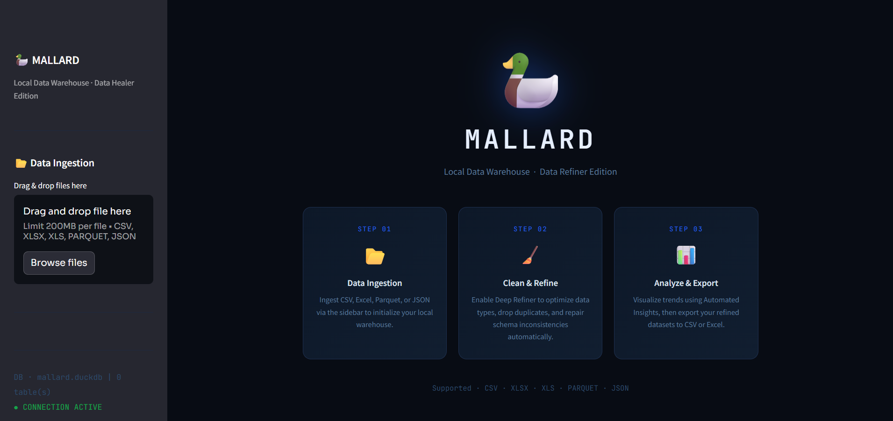
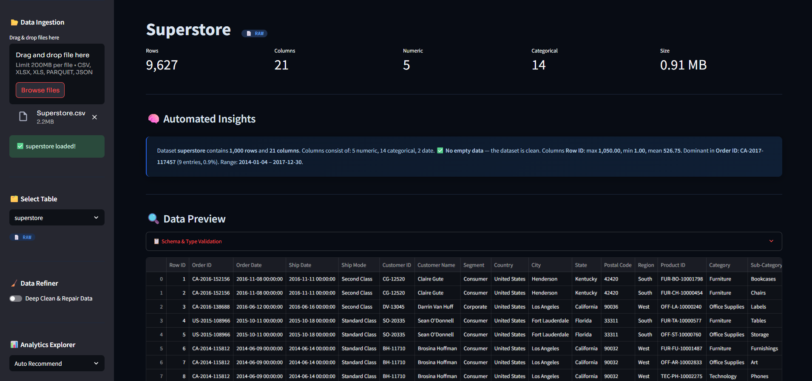

# 🦆 MALLARD




### Local Data Warehouse · Data Refiner Edition

> Drop your CSV, Excel, Parquet, or JSON. Let the duck do the rest.

MALLARD is a **100% local, zero-server data tool** built on DuckDB + Streamlit. Upload messy datasets, auto-clean them, explore with interactive charts, run custom SQL, and export the refined result — all without touching the cloud.

---

## ✨ Features

- **Multi-format ingestion** — CSV, Excel (.xlsx/.xls), Parquet, JSON
- **Auto Deep Clean** — deduplication, empty column removal, numeric & date type healing
- **Smart Summary** — automated insights about your dataset in plain language
- **Analytics Explorer** — Histogram, Bar, Scatter, Line, Box, Correlation Heatmap
- **Custom SQL** — run any DuckDB query directly against your tables
- **Export** — download refined data as CSV, Excel, or Parquet
- **100% local** — data never leaves your machine, no API keys, no internet required
- **Standalone .exe** — distributable to Windows users with no Python setup needed

---

## 🚀 Quick Start

### Option 1 — Run from source

```bash
# 1. Clone repo
git clone https://github.com/KMoex-HZ/mallard.git
cd mallard

# 2. Install dependencies
pip install -r requirements.txt

# 3. Run
streamlit run mallard.py
```

### Option 2 — Windows .exe (no Python needed)

1. Download `MALLARD.zip` from [Releases](../../releases)
2. Extract the zip
3. Double-click `MALLARD.exe`
4. Browser opens automatically at `http://localhost:8501`

---

## 📦 Requirements

```
streamlit==1.45.1
duckdb==1.2.2
pandas==2.2.3
plotly==6.0.1
openpyxl==3.1.5
pyarrow==19.0.1
xlrd==2.0.1
psutil==6.1.1
```

Python 3.10+ recommended.

---

## 🛠️ Build .exe from source

```bash
pip install pyinstaller pyinstaller-hooks-contrib
python setup_exe.py
```

Output: `dist/MALLARD/MALLARD.exe`  
Distribute the entire `dist/MALLARD/` folder as a zip.

---

## 🧹 How Deep Clean works

| Step                  | What it does                                                      |
| --------------------- | ----------------------------------------------------------------- |
| Deduplication         | Removes exact duplicate rows via native SQL `DISTINCT`            |
| Empty column removal  | Drops columns with zero non-null values                           |
| Numeric healing       | Force-casts price/qty/amount/value columns from VARCHAR to DOUBLE |
| Wide-format detection | Auto-melts date-header pivot tables into long format              |

---

## 📁 Project Structure

```
mallard/
├── mallard.py          # Main Streamlit app
├── launcher.py         # Entry point for .exe build
├── setup_exe.py        # PyInstaller build script
├── requirements.txt
└── data/               # Auto-created, drop files here for auto-ingestion
```

---

## 🦆 Why MALLARD?

Most data tools are either too heavy (full BI platforms) or too barebones (just a CSV viewer). MALLARD lives in the middle — a local warehouse that's fast, opinionated, and actually fixes your data before you analyze it.

No Tableau license. No cloud upload. Just a duck and DuckDB.

---

## License

MIT
